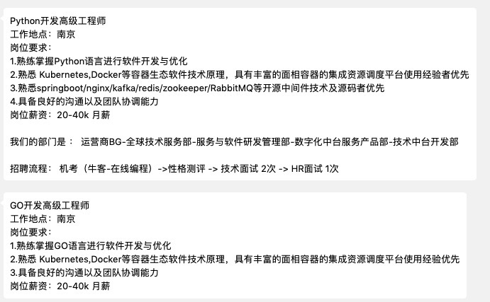

## 华为OD —— 面经

#### 2020年xx月xx日

#### 目录

- [1. 先看一下 jd](#1-先看一下-jd)
- [2. 本人大致情况](#2-本人大致情况)
- [3. 此次流程](#3此次流程)
    - [3.1 笔试](#31-笔试)
    - [3.2 一轮技术面](#32-一轮技术面)
    - [3.3 二轮技术面](#33-二轮技术面)

- [4. 结果](#4-结果)

- [5. 总结](#5总结)

### 1. 先看一下 jd

### 2. 本人大致情况

- 18年毕业，17年11月份实习
    - 2017.11 - 2019.08 某C轮小厂 -  Python开发工程师
    - 2019.08 - 至今 上海突进科技有限公司 - Golang开发工程师

### 3. 此次流程

#### 3.1 笔试

- [华为机试](https://github.com/hackfengJam/LeetCode/commit/04305863ea1cd24c03b9cc7dc0f8a17f7e586a1b)

#### 3.2 一轮技术面

- 描述下现在做的事情
- 有点忘记了...

- coding
    - 输入：n    
    - 输出：小于它的所有质数的个数。

#### 3.3 二轮技术面

- 描述下现在做的事情

- 描述下，下单流程  
    - 订单这边涉及多少表   
    - 订单量级多少？  
    - 数据库压力是否会很大？  
    - 是否需要冷热储备？  
    - 怎么分库的？  

- 接口是存在权限控制？有单独认证服务吗？  

- 平时如何排查问题？
    - pprof？  
    - 用过什么 debug 工具，gdb 有用过吗？  
    - 怎么控制添加和取消断点？  

- 你们服务是怎么打包的？  
    - 对 makefile 是否了解？  
    - 服务有没有调用过 c代码？    
    - 服务都是部署在云上吗？    

- 是否用过排序算法？常用的排序算法？通用的排序算法，怎么设计接口？  

- map 
    - map key 是否是有序的？  
    - 多次 json.Marshal 结果是否相同？  
    - key 是否可以为 指针？  
    - channel 是否可以当 key？  
    - 结构体是否可以当 key？    

- 序列化
    - chan 是否可以序列化？  
    - 用过哪些序列化工具？  
    - 一个结构体 成员变量 是一个指向自己的指针，是否可以 序列化？  
    - 如果自己做应该怎么做?  

- 说下开闭原则、依赖倒转？用过哪些设计模式  

- coding
    - 判断二叉树是否为平衡二叉树  

### 4. 结果

- continuing

### 5. 总结

- 加油吧⛽️   

#### TODO

- 面试答案未及时整理，后续补充，感谢持续关注:)

#### 感谢

- 感谢面试官